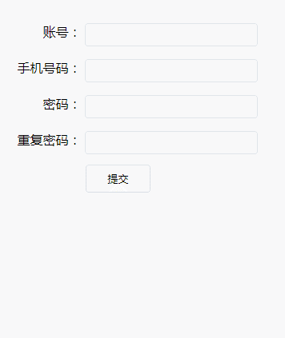

# form validation
## 预览



> 样式问题

参照example的代码使用


## 定义规则

```
| name   | type    |  prompt  |
| :----: | :----:   | :----: |
| input的name| 校验类型      |   设置错误提示文字    |
```
```
var data = {
	"name":{ 
		name: 'name',
		rules: [{
			type: 'isEmpty',
			prompt: '请输入账号!'
		}]
	},
	"phone":{ 
		name: 'phone',
		rules: [{
			type: 'isEmpty',
			prompt: '请输入手机号!'
		},{
			type: 'isPhone',
			prompt: '手机号不正确'
		}]
	},
	"pwd":{
		name:'pwd',
		rules:[{
			type: 'isEmpty',
			prompt: '请输入密码!'
		},{
			type: 'pwdStrong',
			prompt: '密码强度较弱！(6位以上)'
		}]
	},
	"repeat":{
		name:'repeat',
		rules:[{
			type: 'isEmpty',
			prompt: '请输入重复密码!'
		},{
			type: 'repeat',
			prompt: '密码不一致！'
		}]
	}
}
```
## 开始验证
```
| wrap（可选）   | on（可选）    |  onSuccess（可选）  |fields  |
| :----: | :----:   | :----: |:----: |
| form的父元素| 触发条件      |   成功之后提交函数    | 规则数据    |
| body / #form / .form | blur/click/keyup...      |  ajax提交/不选则form提交    | 规则数据    |
```
```
vld.form({
	'wrap':'body',
	'on': 'blur',
	onSuccess:function(){
		// ajax or form
		alert('success');
		vld.ajax({

		})
	},
	'fields': data
})
```

# 相关验证例子

```
var types = {
		// 是否为空
	    isEmpty:function(value){
	        if(value == null || value.length === 0 || /^\s+$/g.test(value)){
	            return false;
	        }
	        return true;
	    },
	    // 手机号或座机
	    isPhone:function(value){
	        var reg = /^([1][3|5|8]\d{9}|\d{4}-?\d{7}|\d{3}-?\d{8})$/;
	        if(reg.test(value)){
	            return true;
	        }
	        return false;
	    }
	}
	return function(value,type){ 
    	//type为检测类型,value为检测的值
        if(!types[type]){
            throw "检测类型不存在";
        }
        if(!types[type](value)){
            return true;
        }
        return false;
    }
```
